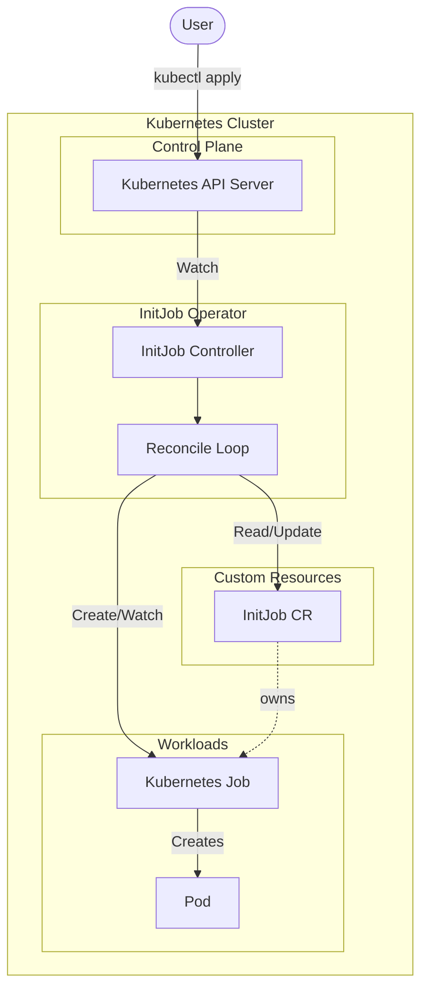
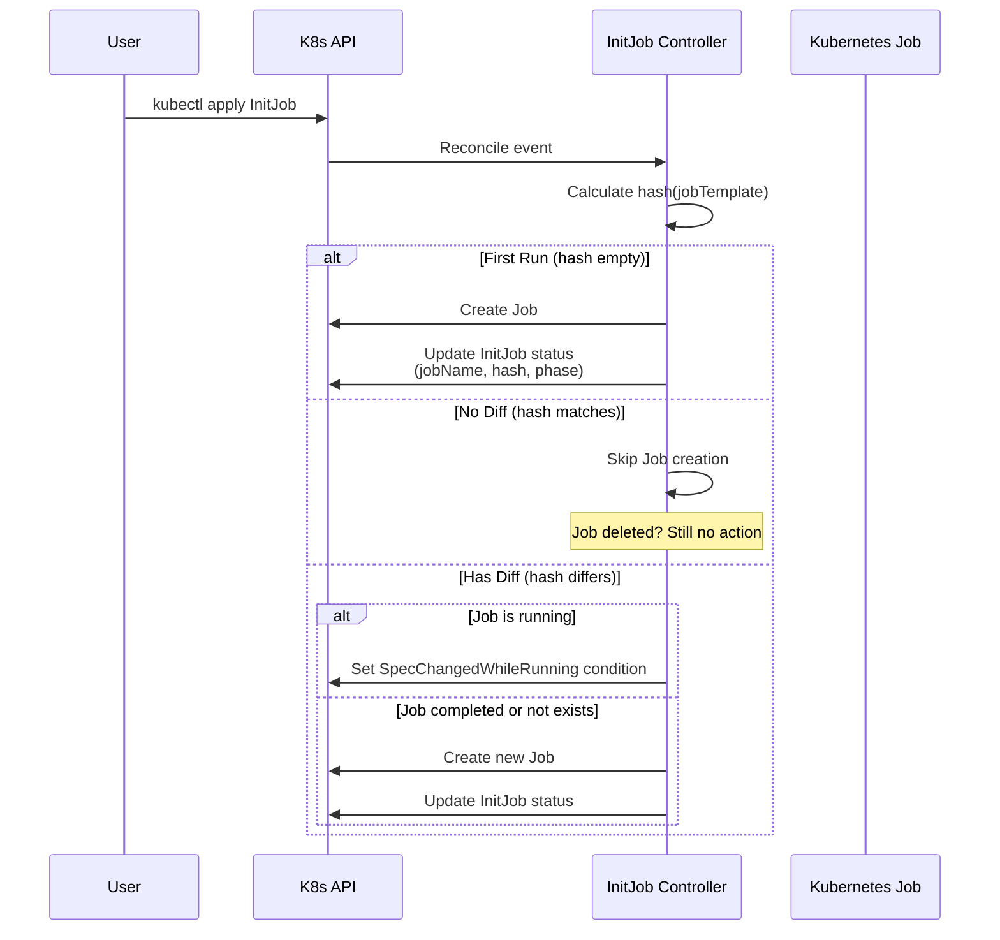

# InitJob Operator

InitJob Operator is a Kubernetes operator that provides a **Custom Resource (InitJob) for declaratively managing initialization processing** on Kubernetes.

## Overview

- When an InitJob CR is created, a **Kubernetes Job is executed once** based on its `spec.jobTemplate`
- Even if the Job is deleted after completion, the InitJob CR **remains as a record of the execution result**
- **A Job is only re-executed when changes to the InitJob are detected as a "diff" from the previous execution**
- If there is no diff, no new Job is created even if the previous Job no longer exists
- Reconciliation is idempotent, preventing unintended Job proliferation

## Architecture



### Reconcile Flow


### Diff Detection



## Use Cases

- Initial database table creation
- Initial data seeding
- First-time provisioning to external services
- One-time validation before/after deployment (preflight / post-deploy init)
- Initial sync processing for microservices (Config/Secret sync, etc.)

## CRD Definition

### API Information

| Item | Value |
|------|-------|
| Group | `batch.init.sre.ryu-tech.blog` |
| Version | `v1alpha1` |
| Kind | `InitJob` |
| Scope | Namespaced |

### Spec

| Field | Type | Description |
|-------|------|-------------|
| `jobTemplate` | JobTemplateSpec | Template for the Job to execute. Represents the "desired init processing". |

### Status

| Field | Description |
|-------|-------------|
| `phase` | Current phase (`Pending` / `Running` / `Succeeded` / `Failed`) |
| `jobName` | Name of the most recently associated Job |
| `lastCompletionTime` | Time when the Job last completed |
| `lastSucceeded` | Whether the last Job execution succeeded |
| `lastAppliedJobTemplateHash` | SHA256 hash of the jobTemplate used for the last execution |
| `conditions` | Detailed status conditions (Ready / JobCreated / SpecChangedWhileRunning) |

## Example

```yaml
apiVersion: batch.init.sre.ryu-tech.blog/v1alpha1
kind: InitJob
metadata:
  name: sample-init
spec:
  jobTemplate:
    metadata:
      labels:
        app: sample-init
    spec:
      backoffLimit: 3
      template:
        spec:
          restartPolicy: Never
          containers:
            - name: init
              image: busybox
              command: ["sh", "-c", "echo init && sleep 5"]
```

### Behavior

1. First `apply` → Job executes
2. Change `command` and `apply` again → Diff detected → Job re-executes
3. `apply` without changes → No new Job created (no diff)

## Getting Started

### Prerequisites

- go version v1.22+
- docker version 17.03+
- kubectl version v1.11.3+
- Access to a Kubernetes v1.11.3+ cluster

### Installation

**Install the CRDs into the cluster:**

```sh
make install
```

**Run the controller locally (for development):**

```sh
make run
```

**Deploy to the cluster:**

```sh
make docker-build docker-push IMG=<your-registry>/initjob-operator:tag
make deploy IMG=<your-registry>/initjob-operator:tag
```

### Usage

**Apply a sample InitJob:**

```sh
kubectl apply -f config/samples/batch.init_v1alpha1_initjob.yaml
```

**Check the status:**

```sh
kubectl get initjobs
kubectl describe initjob sample-init
```

**Check the created Job:**

```sh
kubectl get jobs -l initjob.sre.ryu-tech.blog/name=sample-init
```

### Uninstallation

```sh
# Delete InitJob instances
kubectl delete -k config/samples/

# Delete the CRDs
make uninstall

# Undeploy the controller
make undeploy
```

## Development

### Running Tests

```sh
make test
```

### Building

```sh
make build
```

### Generating Manifests

```sh
make manifests
make generate
```

## Observability

### Recommended Metrics

- `initjob_reconcile_total` - Total reconcile count
- `initjob_reconcile_errors_total` - Reconcile error count
- `initjob_job_executions_total` - Job creation count
- `initjob_job_diff_reexecutions_total` - Re-execution count due to diff detection

### Logging

The controller logs the following information:
- `initjob`, `namespace`, `jobName`, `phase`
- `currentHash`, `lastAppliedHash` for diff detection

## Failure Modes and Mitigations

| Failure Mode | Cause | Mitigation |
|--------------|-------|------------|
| Jobs infinitely re-execute | jobTemplate contains variable values (timestamps, etc.) | Do not include variable values in jobTemplate |
| Jobs never re-execute | Updates do not produce diff | Document which fields are used for diff detection |
| Spec changed while running | User updated spec during Job execution | v1alpha1 keeps it simple: do not touch running Jobs, notify via Condition |

## License

Copyright 2025.

Licensed under the Apache License, Version 2.0 (the "License");
you may not use this file except in compliance with the License.
You may obtain a copy of the License at

    http://www.apache.org/licenses/LICENSE-2.0

Unless required by applicable law or agreed to in writing, software
distributed under the License is distributed on an "AS IS" BASIS,
WITHOUT WARRANTIES OR CONDITIONS OF ANY KIND, either express or implied.
See the License for the specific language governing permissions and
limitations under the License.
