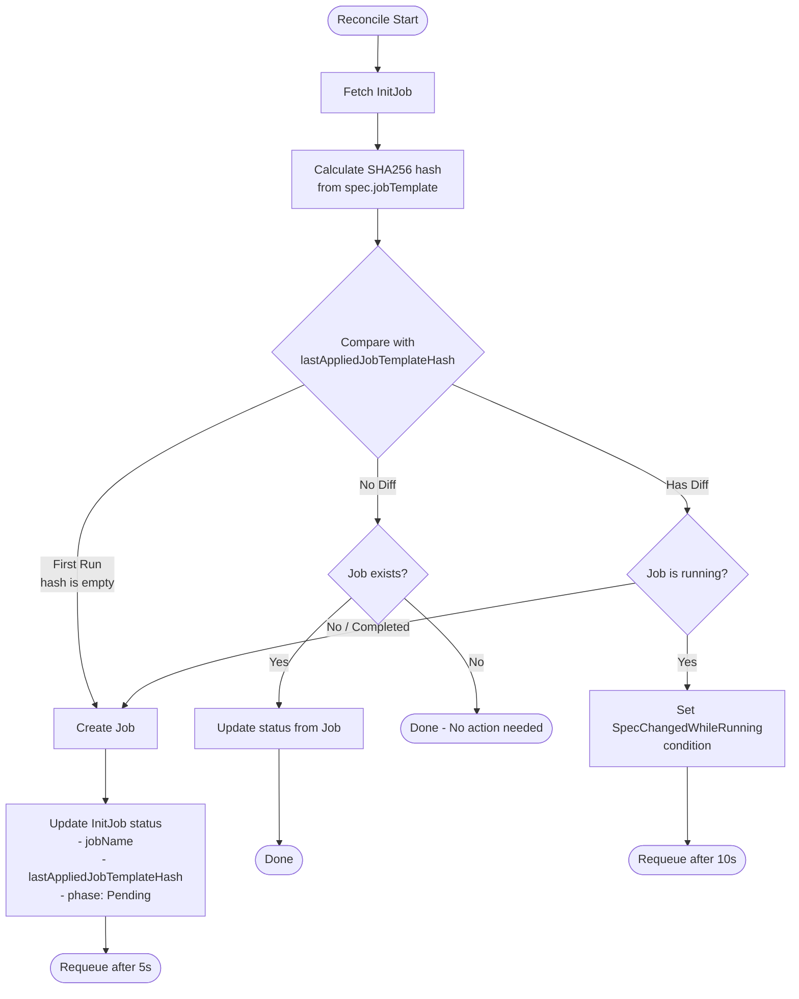
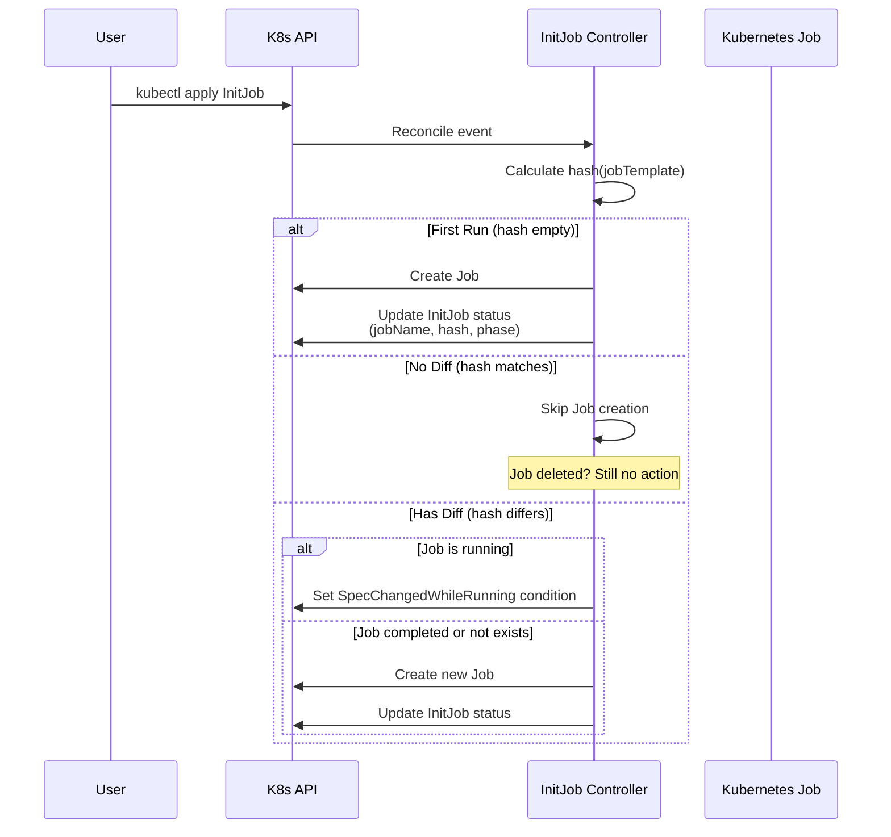

# InitJob Operator

[](LICENSE)
[](go.mod)

InitJob Operator is a Kubernetes operator that provides a **Custom Resource (InitJob) for declaratively managing initialization processing** on Kubernetes.

## Overview

- When an InitJob CR is created, a **Kubernetes Job is executed once** based on its `spec.jobTemplate`
- Even if the Job is deleted after completion, the InitJob CR **remains as a record of the execution result**
- **A Job is only re-executed when changes to the InitJob are detected as a "diff" from the previous execution**
- If there is no diff, no new Job is created even if the previous Job no longer exists
- Reconciliation is idempotent, preventing unintended Job proliferation

## Use Cases

- Initial database table creation
- Initial data seeding
- First-time provisioning to external services
- One-time validation before/after deployment (preflight / post-deploy init)
- Initial sync processing for microservices (Config/Secret sync, etc.)

## Installation

### Prerequisites

- kubectl v1.11.3+
- Access to a Kubernetes v1.11.3+ cluster

### Option 1: kubectl apply (Recommended)

You can install everything with a single command using the `install.yaml` included in each release. (Available from v1.0.0 onwards)

```sh
# Replace <VERSION> with the desired release version (e.g., v0.1.0)
kubectl apply -f https://github.com/S-mishina/initjob-operator/releases/download/<VERSION>/install.yaml
```

This single command deploys the CRD, RBAC, and controller all at once.

### Option 2: Kustomize Remote Reference

You can deploy directly using Kustomize remote references without cloning the repository.

```sh
# Replace <VERSION> with the desired release tag (e.g., v0.1.0)
kustomize build "https://github.com/S-mishina/initjob-operator/config/default?ref=<VERSION>" | kubectl apply --server-side -f -
```

To customize the image tag, create your own `kustomization.yaml`:

```yaml
# kustomization.yaml
apiVersion: kustomize.config.k8s.io/v1beta1
kind: Kustomization
resources:
  - https://github.com/S-mishina/initjob-operator/config/default?ref=<VERSION>
images:
  - name: controller
    newName: ghcr.io/s-mishina/initjob-operator
    newTag: "<VERSION>"
```

```sh
kustomize build . | kubectl apply --server-side -f -
```

### Option 3: Container Image from GHCR

Container images are available on GitHub Container Registry.

```sh
docker pull ghcr.io/s-mishina/initjob-operator:<VERSION>
```

If you clone the repository and use `make deploy`:

```sh
make deploy IMG=ghcr.io/s-mishina/initjob-operator:<VERSION>
```

### Verify Installation

```sh
# Verify the controller is running
kubectl get pods -n initjob-operator-system

# Verify the CRD is installed
kubectl get crd initjobs.batch.init.sre.ryu-tech.blog
```

## Quick Start

### 1. Create an InitJob

```yaml
# initjob.yaml
apiVersion: batch.init.sre.ryu-tech.blog/v1alpha1
kind: InitJob
metadata:
  name: sample-init
spec:
  jobTemplate:
    metadata:
      labels:
        app: sample-init
    spec:
      backoffLimit: 3
      template:
        spec:
          restartPolicy: Never
          containers:
            - name: init
              image: busybox
              command: ["sh", "-c", "echo init && sleep 5"]
```

```sh
kubectl apply -f initjob.yaml
```

### 2. Check the Status

```sh
kubectl get initjobs
kubectl describe initjob sample-init
kubectl get jobs -l initjob.sre.ryu-tech.blog/name=sample-init
```

### 3. Re-execution via Diff Detection

1. First `apply` → Job executes
2. Change `command` and `apply` again → Diff detected → Job re-executes
3. `apply` without changes → No new Job created (no diff)

## Uninstallation

**Option 1 (installed via `install.yaml`):**

```sh
kubectl delete -f https://github.com/S-mishina/initjob-operator/releases/download/<VERSION>/install.yaml
```

**Option 2 (installed via Kustomize):**

```sh
kustomize build "https://github.com/S-mishina/initjob-operator/config/default?ref=<VERSION>" | kubectl delete -f -
```

**Option 3 (installed via `make deploy`):**

```sh
make undeploy
```

## Architecture


### Reconcile Flow



### Diff Detection



## Observability

### Recommended Metrics

- `initjob_reconcile_total` - Total reconcile count
- `initjob_reconcile_errors_total` - Reconcile error count
- `initjob_job_executions_total` - Job creation count
- `initjob_job_diff_reexecutions_total` - Re-execution count due to diff detection

### Logging

The controller logs the following information:

- `initjob`, `namespace`, `jobName`, `phase`
- `currentHash`, `lastAppliedHash` for diff detection

## Failure Modes and Mitigations

| Failure Mode | Cause | Mitigation |
|--------------|-------|------------|
| Jobs infinitely re-execute | jobTemplate contains variable values (timestamps, etc.) | Do not include variable values in jobTemplate |
| Jobs never re-execute | Updates do not produce diff | Document which fields are used for diff detection |
| Spec changed while running | User updated spec during Job execution | v1alpha1 keeps it simple: do not touch running Jobs, notify via Condition |

## Development

### Prerequisites

- Go 1.24+
- Docker 17.03+
- kubectl v1.11.3+
- Access to a Kubernetes v1.11.3+ cluster

### Building and Running Locally

```sh
# Run tests
make test

# Build the binary
make build

# Install CRDs and run the controller locally
make install
make run
```

### Building and Pushing a Custom Image

```sh
make docker-build docker-push IMG=<your-registry>/initjob-operator:tag
make deploy IMG=<your-registry>/initjob-operator:tag
```

### Generating Manifests

```sh
make manifests
make generate
```

## License

Copyright 2025.

Licensed under the Apache License, Version 2.0 (the "License");
you may not use this file except in compliance with the License.
You may obtain a copy of the License at

    http://www.apache.org/licenses/LICENSE-2.0

Unless required by applicable law or agreed to in writing, software
distributed under the License is distributed on an "AS IS" BASIS,
WITHOUT WARRANTIES OR CONDITIONS OF ANY KIND, either express or implied.
See the License for the specific language governing permissions and
limitations under the License.
